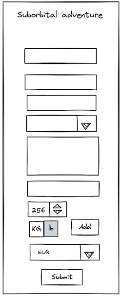

# Suborbital Space Adventure (Junior Web Dev Test Task)

Your task is to create a ticket order form for a suborbital space flight.

## Requirements

### Basic Information

A user should be able to register themselves. Basic info includes the applicant's first and last
name, a valid email address, citizenship (a select list), a brief explanation of their motivation,
preferred mass units (kg/pounds, with kg as the default) and currency (EUR by default). All fields
are required, except those with defaults. If a required field is empty or invalid, the user receives
a warning.

### Passengers

Each ticket can include several passengers. The first passenger is always the applicant, but they
can add more. For each passenger, the name and mass must be specified. The total mass of all
passengers on a ticket should be less than 300 kg. If the mass exceeds 300 kg, the user is warned,
and both the `submit` and `add` buttons are disabled. The `Add` button is also disabled if the mass
exceeds 250 kg (since no person weighs less than 50 kg).

### Price Calculation

The base ticket price is €20,000, which includes a base price for one passenger. Each additional
passenger increases the total price by a base per-passenger price of €8,000. For each passenger,
each additional kilogram beyond 50 is priced at €100 per kg. The total price is recalculated and
displayed to the user with every update to the passenger list.

The total price is shown in the user's preferred currency; the exchange rate is fetched from
[Exchange Rate API][1].

[1]: https://www.exchangerate-api.com/docs/free

### Form Submission

Upon submission, an alert pops up congratulating the user on purchasing the a ticket for `amount`
of `currency`. A JSON object with all the data provided by the user is written to the console.

## Mockups

### Desktop

### Mobile

## Technical Constraints

The task must be completed **without the use of any JS frameworks or libraries**. I should be able
to just launch a web server in the folder with your `index.html` and see the result without any
build steps. Use only vanilla JS, CSS, HTML, and browser APIs. Only modern browsers need to be
supported; however, do not use experimental or browser-specific APIs.

## Task Submission and Evaluation Notes

Submit the task as a GitHub repo (send a link to [@rombek](https://t.me/rombek)). However, **do not
fork this repo**.

Good UX is mandatory. Clean design is also preferable. You may draw inspiration from your favorite
design kit; however, don't go overboard with sophisticated animations, etc.

Both desktop and mobile layouts should look good and function well. The general layout should follow
the mockups provided.

Remember that remote servers are not 100% reliable.

Clean, well-documented code is mandatory. You may use ChatGPT or any other resources; however, be
prepared to explain every aspect of your code and justify the decisions you made during development.
