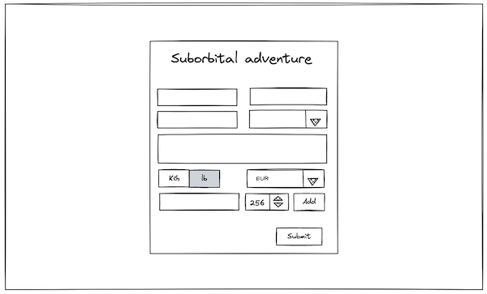

# Suborbital Space Adventure (junior web dev test task)

Your task is to create a ticket order form for a suborbital space flight.

## Requriements

### Basic information

A user should be able to register themselves. Basic info includes applicant first and last name,
valid email address, citisenship (a select list), a brief explanation of their motivation, preferred
mass units ( kg/pounds, kg by default) and currency (EUR by default). All fields are required,
except those which have defaults. If a required field is empty or invalid, the user is warned.

### Passengers

Each ticket can include several passengers. First passenger is always an applicant, but they can add
more. For each passenger the name and mass must be specified. Total mass of all passengers in a
ticket should be less than 300 kg. If the mass exceeds 300kg user is warned and both `submit` and
`add` butons are disabled. `Add` button is also disabled if mass is more than 250 kg (because no
person weights less than 50kg).

### Price calculation

The base ticket price is €20,000, this includes a base price for one passenger. Each additional
passenger adds to total price a base per-passenger price of €8,000. For each passenger, each
additional kilogramm beyond 50 is prised as €100 per kg. Total price is re-calculated and shown to
the user at every update in passenger list.

Total price is shown in user's preferred currency, the exchange rate is fetched from [Exchange Rate
API][1].

1: https://www.exchangerate-api.com/docs/free

## Mockups

### Desktop

### Mobile

![mobile mockup](./mock-ups/mobile.png

## Technical constrants

## Task evaluation notes

A good UX is mandatory.
